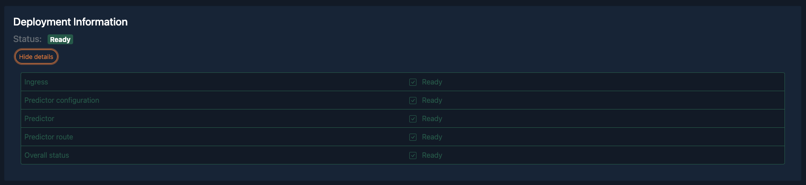

# Melio Data Science Interview (with Highwind)

## Full Name Classifier Assignment

You received a dataset from your client containing a list of names and their potential classifications. Your client asks you to build a basic Web based HTTP API that their own frontend application can integrate with. The client's frontend application will send a request containing a user's Full Name and your API will return the classification of the name.

Your task is to build a basic end-to-end machine learning system that allows the following:

  1. An API that returns the classification of the name, either `Person`, `Company` or `University`

     - The logic of the classification can be a rule-based or machine learning classifier 

     - The backend must be a web service that provides an HTTP API

  2. The API backend must be hosted on [Highwind](https://docs.highwind.ai):

     - Highwind uses [KServe v0.10](https://kserve.github.io/website/0.10/) for model serving, which means your model needs to support Kserve.
       - An overview of model deployment on Highwind can be found here: https://docs.highwind.ai/zindi/deploy/.
       - An extensive tutorial on how to deploy a model on Highwind can be found here: https://docs.highwind.ai/tutorials/deploy-custom/. 

An example of the user workflow is as follows:

  1. User makes a request containing `Bob Immerman` to the Highwind API.
  2. The API classifies Bob and returns the classification as `Person`.

## Task Details

There are three main tasks in the problem, and as the consultant, you can decide on the relative importance of each:

  1. Building the classifier
  2. Model inference server (via Kserve) as an API
  3. Hosting the model on Highwind

You should limit yourself to 4 hours, and make tradeoffs based on the allotted timeframe.

### Task 1: Building the classifier

This is the main data science component of the technical assessment.

Build a classifier to determine whether the name belongs to a `Person`, `Company`, or `University`:

- You can use any library you want.
- You can use a rule-based classification, a pre-built model/embedding, build a model yourself or a hybrid.
- Format:
  - If you are building an ML solution, the training of your model can be in a Jupyter notebook.
  - If you are not building an ML solution, you will have to embed your Python code into the app.

Note that the classifications are generated by the client's upstream system, but they are not always correct. 

**Task 1 Evaluation Criteria:** Your classifier will be evaluated based on a hidden test set.

### Task 2: Inference Server (via Kserve)

This task evaluates whether you understand what is involved in putting a classifier into production.

Build an inference server that accepts a string as an input and returns the classification, adhering to the JSON format that Kserve accepts.

- You can use any framework that can be served via Docker.
- You do not need to build a database component.
- Format:
  - The model is contained in a Docker image following: https://docs.highwind.ai/tutorials/deploy-custom/.
  - The model is exposed via the Kserve API following: https://docs.highwind.ai/tutorials/deploy-custom/.
    - Here is a provided example on how to build a deployment docker image: https://github.com/highwind-ai/examples/tree/main/translate-dyu-fr-hugging-face/deployment

**Task 2 Success Criteria:** Your inference server API is accessible and can respond with the appropriate classification based on the input.

### Task 3: Model Hosting on Highwind

Deploy your model on Highwind. This includes creating the associated Asset and then deploying it as a Use Case. After a successful deployment in your Use Case, you should be able to see this image below:

You can then test if your inference API is working by using the Hosted Inference API section in the Use Case:

Considerations:
1. The deployed model must adhere to the following hardware restrictions (or the deployment will fail):
   1. CPU: Not more than 1 vCPU
   2. Memory: Not more than 2GB RAM
   3. Docker Image Size: Less than 6GB

**Task 3 Success Criteria:** Your deployed model on Highwind is able to receive requests and respond appropriately.

## Overall Evaluation Criteria:

  1. Write a brief summary to critically evaluate your solution.
  2. You should limit yourself to 4 hours, and make tradeoffs based on the allotted timeframe.
  3. There is no right or wrong answer, but give a clear reasoning on each step you took. 

## Submission Requirements

  1. Give enough information on how to run your solution (i.e., Python version, packages, requirements.txt, Dockerfile, etc.).
  2. State all of your assumptions, if any.
  3. There is no right or wrong answer, but give a clear reasoning on each step you took. 
  4. You can zip your code and email it to your hiring manager, or you can push it onto GitHub and let your hiring manager know.

## Dataset

**Note:** The dataset for this assignment should be provided to you separately by your hiring manager. If you haven't received it, please contact them.
