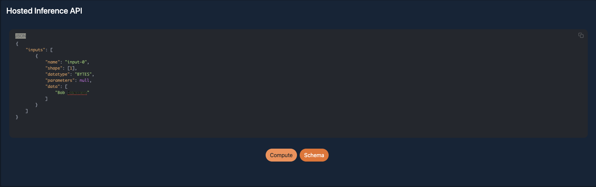

# Melio Data Science Interview (with Highwind)

## Full Name Classifier Assignment

You received a dataset from your client containing a list of names and their potential classifications. Your client asks you to build a basic Web based HTTP API that their own frontend application can integrate with. The client's frontend application will send a request containing a user's Full Name and your API will return the classification of the name.

Your task is to build a basic end-to-end machine learning system that allows the following:

  1. An API that returns the classification of the name, either `Person`, `Company` or `University`

     - The logic of the classification can be a rule-based or machine learning classifier 

     - The backend must be a web service that provides an HTTP API

  2. The API backend must be hosted on [Highwind](https://docs.highwind.ai):

     - Highwind uses [KServe v0.10](https://kserve.github.io/website/0.10/) for model serving, which means your model needs to support Kserve.
       - An overview of model deployment on Highwind can be found here: https://docs.highwind.ai/zindi/deploy/.
       - An extensive tutorial on how to deploy a model on Highwind can be found here: https://docs.highwind.ai/tutorials/deploy-custom/. 

An example of the user workflow is as follows:

  1. User makes a request containing `Bob Immerman` to the Highwind API.
  2. The API classifies Bob and returns the classification as `Person`.

## Task Details

There are three main tasks in the problem, and as the consultant, you can decide on the relative importance of each:

  1. Building the classifier
  2. Model inference server (via Kserve) as an API
  3. Hosting the model on Highwind

You should limit yourself to 4 hours, and make tradeoffs based on the allotted timeframe.

### Task 1: Building the classifier

This is the main data science component of the technical assessment.

Build a classifier to determine whether the name belongs to a `Person`, `Company`, or `University`:

- You can use any library you want.
- You can use a rule-based classification, a pre-built model/embedding, build a model yourself or a hybrid.
- Format:
  - If you are building an ML solution, the training of your model can be in a Jupyter notebook.
  - If you are not building an ML solution, you will have to embed your Python code into the app.

Note that the classifications are generated by the client's upstream system, but they are not always correct. 

**Task 1 Evaluation Criteria:** Your classifier will be evaluated based on a hidden test set.

### Task 2: Inference Server (via Kserve)

This task evaluates whether you understand what is involved in putting a classifier into production.

Build an inference server that accepts a string as an input and returns the classification, adhering to the JSON format that Kserve accepts.

- You can use any framework that can be served via Docker.
- You do not need to build a database component.
- Format:
  - The model is contained in a Docker image following: https://docs.highwind.ai/tutorials/deploy-custom/.
  - The model is exposed via the Kserve API following: https://docs.highwind.ai/tutorials/deploy-custom/.
    - Here is a provided example on how to build a deployment docker image: https://github.com/highwind-ai/examples/tree/main/translate-dyu-fr-hugging-face/deployment

**Task 2 Success Criteria:** Your inference server API is accessible and can respond with the appropriate classification based on the input.

### Task 3: Model Hosting on Highwind

Deploy your model on Highwind. This includes creating the associated Asset and then deploying it as a Use Case. After a successful deployment in your Use Case, you should be able to see this image below:

You can then test if your inference API is working by using the Hosted Inference API section in the Use Case:

Considerations:
1. The deployed model must adhere to the following hardware restrictions (or the deployment will fail):
   1. CPU: Not more than 1 vCPU
   2. Memory: Not more than 2GB RAM
   3. Docker Image Size: Less than 6GB

**Task 3 Success Criteria:** Your deployed model on Highwind is able to receive requests and respond appropriately.

## Overall Evaluation Criteria:

  1. Write a brief summary to critically evaluate your solution.
  2. You should limit yourself to 4 hours, and make tradeoffs based on the allotted timeframe.
  3. There is no right or wrong answer, but give a clear reasoning on each step you took. 

## Submission Requirements

  1. Give enough information on how to run your solution (i.e., Python version, packages, requirements.txt, Dockerfile, etc.).
  2. State all of your assumptions, if any.
  3. There is no right or wrong answer, but give a clear reasoning on each step you took. 
  4. You can zip your code and email it to your hiring manager, or you can push it onto GitHub and let your hiring manager know.

## Dataset

**Note:** The dataset for this assignment should be provided to you separately by your hiring manager. If you haven't received it, please contact them.

## MATTHEW PROJECT ANALYSIS, ASSUMPTIONS AND PROJECT SUMMARY

## Project Planning

### Time Allocations

| Task                                        | Estimated Time | Actual Time |
|---------------------------------------------|----------------|-------------|
| Planning                                    | 45 min         | 45 min      |
| Lit review and decisions for classifier     | 30 min         | 1.5 hour    |
| Building model                              | 1 hour         | 1.5 hour    |
| Model inference server (via Kserve) as an API | 1-2 hour       | -           |
| Hosting the model on Highwind               | Remaining time | -           |
| Recap                                       | 15 minutes     |             |
| **Total time**                              | **4 hours**    |             |

---

## Plan

### Plan for Classifier
**Time allocation:** 1.5 hours (0.5 hours for literature review and 1 hour for implementation)

- Research current best SOTA model for name classification
- Find review paper or similar on the topic
- Find a maximum of 3 potential classifiers with the following attributes:
  - High accuracy in classification
  - Compatible with KServe API
  - Does not use more than 1 vCPU
  - Memory less than 2GB of RAM
  - Docker image less than 6GB of RAM
  - Model is trainable on available hardware (4GB of GPU memory)
  - Model has documentation and deployment code available (similar to YOLO)
  - Model has pretrained option (from large dataset) — *if possible*
- Get an overview of positives and negatives of each model (assumptions and GPT will be used to help with investigation due to time limits — normally more investigation would be done)
- Identify evaluation metrics that will be used, state the metrics and what they indicate
- Investigate dataset to pretrain model. State the dataset (no need to train for lack of time)
- Make choice to train one of the models. State that all three would be trained to get best results if time permitted, using same procedure as chosen model
- Research most important hyperparameters to optimise (maximum 3) — otherwise default parameters or research-based decision
- Decide on hyperparameters to investigate in a grid search
- Do data exploration
- Check label quality and make decision on how to handle or identify noisy or bad labels
- Check for imbalanced classes and make decision on how to handle imbalance if present
- Identify required data preprocessing considering case, punctuation, prefixes, special characters, etc. and make decision on what data preprocessing is required
- Final clean dataset, with splits defined
- Investigate if any augmentation is available (that is easy to implement — state findings if not used) and decide what augmentation to do
- Create pipeline for training models in background using chosen hyperparameters — do not run yet
- Note that K-5 evaluation could be used to test model if time permitted
- Decide on hyperparameters for single best model based on research and train that model first (as unlikely time permits to train multiple models using hyperparameters and models)
- State training procedure including the use of transfer learning or frozen layers
- Use trained model to set up Inference Server (via KServe)

### Plan for Inference Server (via KServe)
**Time allocation:** 1–2 hours (time permitting)

**Note:** I have never done this before, so I will only attempt if time permits. This is the process I would normally follow to solve an unknown task (again I would do further investigation myself if time permitted):

- Read at least one minimal example of a KServe-compatible model to get grounded context. Potentially find video tutorial
- Quick summary read through of documentation
- Ask GPT for help on overview of step-by-step process of what is required and what considerations/decisions need to be considered when setting up. Use the following prompts:
  - List all considerations and decisions that need to be made, in terms of frameworks and methodologies. Give a maximum of 3 options for each decision. List the most important tradeoffs when deciding on a method. Provide a suggested way forward. Consider the full pipeline and how earlier decisions will affect later decisions.
- Follow steps provided, taking into account documentation provided and suggested procedure — record the process followed
- Implement

### Repeat Plan for Model Hosting on Highwind (time permitting)
**Time allocation:** 1 hour (time permitting)

- Write considerations of:
  - How to log and monitor inference time
  - What will be used for serving (e.g., FastAPI or Flask)

---

## Project Execution

### Classifier

#### Literature Review
**Review paper:** [Large Language Models For Text Classification: Case Study And Comprehensive Review](https://arxiv.org/html/2501.08457v1?utm_source=chatgpt.com)

**Takeaways:**
Three primary methods:
- **Traditional ML Models**  
  - Fast inference and computationally efficient  
  - Examples: Naive Bayes, SVM  
  - Good option
- **Transformer-Based Models**  
  - Balance performance and computational requirements  
  - Example: RoBERTa  
  - Good option but likely too large. Only consider if traditional models fail
- **LLMs**  
  - High accuracy, high computational complexity  
  - Example: LLaMA 3, GPT-4, DeepSeek  
  - Last resort. Likely overkill for the task

**Choice of methods:**
- Traditional ML Model x2
- Transformer-Based x1

**NOTE:** With more time, an in-depth assessment of each of these methods and additional review papers would be considered. Ideally, 3 architectures would be tested (Naive Bayes, SVM, RoBERTa).

**Evaluation metrics (most commonly used):**
- F1 score
- Inference time

**Preprocessing considerations:**
- Normalised input names
- Handling variations in casing, punctuation, special characters

#### Choice of 3 Models

##### 1. Logistic Regression with TF-IDF (Traditional ML)
**Implementation:**
- scikit-learn (LogisticRegression + TfidfVectorizer)
- Simple pipeline: TfidfVectorizer -> LogisticRegression
- Easily deployable via joblib or pickle for KServe

**Meets Criteria:**
- High accuracy for short text or structured data like names
- Lightweight: <200MB memory during inference
- KServe-compatible: Fully Python serialisable
- Docker image: <300MB with Python slim base
- No GPU required
- Widely documented (scikit-learn.org)

**Reference:**
- Pedregosa et al., Scikit-learn: Machine Learning in Python, JMLR (2011)

##### 2. Naive Bayes with n-gram features (Traditional ML)
**Implementation:**
- MultinomialNB from scikit-learn with CountVectorizer or TfidfVectorizer
- Character n-grams (e.g., 2–5) for better performance on name classification

**Meets Criteria:**
- Very fast training and inference
- Low RAM and CPU usage (<50MB for small models)
- Highly interpretable
- KServe-compatible
- Docker image: Small (~200MB)

**Reference:**
- Rennie et al., Tackling the poor assumptions of naive bayes classifiers, ICML (2003)

##### 3. DistilBERT (Transformer-Based)
**Implementation:**
- Use distilbert-base-uncased via HuggingFace Transformers
- Fine-tune on your CSV data using HuggingFace Trainer or AutoModelForSequenceClassification

**Meets Criteria:**
- Pretrained on a massive corpus
- High accuracy on small NLP classification tasks
- Smaller and faster than BERT (~65M params)
- 4GB GPU compatible for fine-tuning (batch size = 8)
- Docker image: Can fit <6GB with transformers + torch
- KServe support: See Highwind HuggingFace KServe Example

**Reference:**
- Sanh et al., DistilBERT, a distilled version of BERT: smaller, faster, cheaper and lighter, arXiv:1910.01108
- Hugging Face Docs: https://huggingface.co/transformers

| Model               | Accuracy | Lightweight | Pretrained | KServe-Compatible | Docs + Examples |
|--------------------|----------|-------------|------------|-------------------|------------------|
| LogisticReg + TF-IDF | Medium   | Good        | No         | Yes               | Yes              |
| Naive Bayes        | Medium   | Excellent   | No         | Yes               | Yes              |
| DistilBERT         | Medium   | Moderate    | Yes        | Yes               | Yes              |

**Conclusion:**
- I would train all and decide on tradeoff of accuracy vs speed and computational complexity.
- As DistilBERT is pretrained, I expect better performance.
- **For this assignment, I chose Logistic Regression with TF-IDF** due to simplicity and time constraints.

#### Metrics
I will use **F1-score, accuracy, recall and confusion matrix**

#### Pretraining Datasets Considered
The following large, clean, open-source datasets were identified as suitable for pretraining. While no pretraining was done for this assignment due to time constraints, I would investigate their effectiveness in future iterations.
- **CoNLL-2003 Named Entity Recognition Dataset**  
  - Source: https://paperswithcode.com/dataset/conll-2003 
  - Description: A benchmark dataset for named entity recognition tasks, containing annotations for entities such as persons organizations, and locations.
- **JRC-Names**  
  - Source: https://arxiv.org/abs/1309.6162
  - Description: A multilingual named entity resource compiled from large-scale news analysis and Wikipedia mining. It includes over 205,000 person and organization names with various spelling variants across more than 20 scripts and languages.

- **DBpedia**  
  - Source: https://en.wikipedia.org/wiki/DBpedia?utm_source=chatgpt.com 
  - Description: An open-source project that extracts structured content from Wikipedia, including information on persons, organizations, and educational institutions.

Further investigation required but I think option 1 would be the best for pretraining (but non was implemented):
**CoNLL-2003 Named Entity Recognition Dataset**

#### Potential data augmentation techniques
- **Pattern Substitution, Injection or removal (person)**
  - Randomly prepend or remove titles (e.g. Mr, Dr, Prof, Mrs) to names
  - Improves robustness to titles that don’t affect class label
- **Pattern Substitution, Injection or removal	(company)**
  - Replace, add or remove common company/legal suffixes (e.g., Ltd, Inc, LLC)	
  - Boosts understanding of label-defining suffixes
- **Pattern Substitution, Injection or removal	(University)**
  - Replace, add or remove common univesity suffixes (e.g., university, college, Universida	
  - Boosts understanding of label-defining suffixes
- **Duplicate Entries with Character Noise**
  - Insert/remove one random space or swap two adjacent characters creating slightly altered versions of the same name with same label	
  - Makes model more robust to typos and OCR-like input	
  - Increases dataset size & diversity

I would perform all these augmentation techniques to improve performance. Each name will be augmented only once using a randomly selected aug technique. Ensure that titles are added or dropped to only person and synonym substitution is only conducted on the relevant category of company or university.
**Chosen aug techniques: all**

#### Hyperparameters Search

Normally a grid search of the parameters with the three chosen values would be implemented. The best performing combination would be used.

##### 1. C (Inverse of Regularisation Strength)  
- **Why important:** Controls the amount of regularisation. Higher values mean less regularisation (risk overfitting), lower values increase it (risk underfitting).
- **Three values:** 0.1, 1.0, 10.0  
- **Chosen value:** 1.0  
- **Reason:** Default value that often balances bias and variance well, especially when time is limited.

##### 2. ngram_range (TF-IDF Vectoriser)  
- **Why important:** Defines the length of character/word sequences used as features. For names, character n-grams are especially useful to capture suffixes, prefixes, and spelling patterns.
- **Three values:** (2, 3), (2, 5), (3, 6)  
- **Chosen value:** (2, 5)  
- **Reason:** Proven to be effective in name/entity classification tasks — captures both short and moderately long patterns without exploding feature size.

##### 3. max_features (TF-IDF Vectoriser)  
- **Why important:** Limits the vocabulary size. Controls model complexity and memory use — important for deployment on resource-constrained systems.
- **Three values:** 1000, 3000, 5000  
- **Chosen value:** 3000  
- **Reason:** Provides a strong balance between feature richness and compactness for ~4500-entry datasets.

**Due to time constraints no hyperparameter search was done and it was assumed that the following hyperparameter combination performed best:**  
- C (Inverse of Regularisation Strength) = 1  
- ngram_range (TF-IDF Vectoriser) = (2,5)  
- max_features (TF-IDF Vectoriser) = 3000

---

#### Implementation

##### Data Exploration

**Visual inspection notes:**
- Incorrect labels are present but not that common
- Prefixes are present for names and are often incorrect or doubled
- Punctuation is present and not consistent
- Capitals are present and not consistent

**Steps Taken:**
- First remove all accents, capitals and punctuation to create cleaner data to work with
- Identify and remove known mislabelled instances using a pattern-based removal (if time permitted an additional manual relabel and check could be done)
- Count the suffixes
- Count company patterns
- Count university patterns

---

##### Train/Test Split and Data Augmentation

- Need to create a train/test split where test contains 10% of each of the categories for fair evaluation
- Need to have even split of classes (use class_weight = 'balanced')

**Augmentation:**
- Remove all the label patterns from each category in the dataset, then re-add a random pattern (including no pattern) from that specific category. The idea is to get a random, but somewhat even mix of the patterns (including no pattern) in the training dataset.
- Duplicate Entries with Character Noise

---

##### Train Model

- Model has poor recall of underrepresented categories
- Attempted to apply aggressive augmentation to underrepresented categories. This improved performance but still poor
- Tried removing 80% of the examples of the `Person` category to balance the dataset. This helped in a minor way

**Final analysis:**  
Model is too simple or hyperparameters are not optimal.  
Time ran out before Task 2 could be attempted.

---

## Brief Summary

Due to the nature of this task, the time restriction, and lack of knowledge of Tasks 2 and 3, I have spent more time writing out a comprehensive plan, decision-making process, considerations, and how I would approach the task given more time. I focused more on the explanation and structured approach I would take to solve such a problem rather than the implementation.

The final choice of model was not ideal, with the model potentially being too simple to model the data. If I had to go back, I would have chosen the DistilBERT model, as I believe this would achieve greater accuracy, and should still fit within the desired metrics. Ideally, I would have trained each of the models and performed a hyperparameter search on each to get an optimal model.

I did not manage to alleviate the issue of class imbalance with my chosen model. I believe that with a pretrained model I could have reduced the dataset and still trained a more accurate model. I would also have looked into more effective augmentation techniques to increase the size of the underrepresented categories.

I do not have experience with Tasks 2 and 3. I have written how I would approach such a challenge and, if I had time, I would have attempted these.

